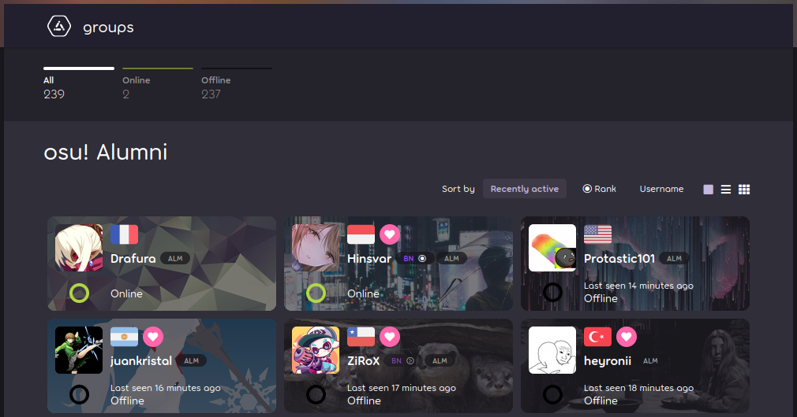

---
tags:
  - groups
  - user group
  - user groups
  - usergroup
  - usergroups
---

# Group

**Groups** are a feature of the website that lets multiple users inherit the same privileges, identifying badges, and [colours](/wiki/Community/User_colour).

NAT <-- QAT <-- BAT
